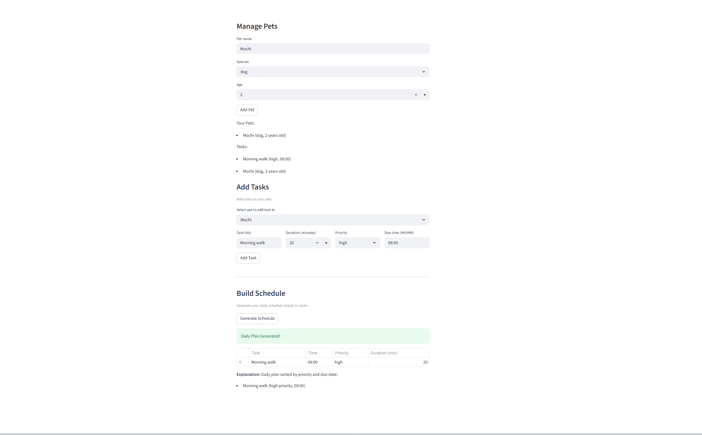

# PawPal+ (Module 2 Project)

You are building **PawPal+**, a Streamlit app that helps a pet owner plan care tasks for their pet.

## Scenario

A busy pet owner needs help staying consistent with pet care. They want an assistant that can:

- Track pet care tasks (walks, feeding, meds, enrichment, grooming, etc.)
- Consider constraints (time available, priority, owner preferences)
- Produce a daily plan and explain why it chose that plan

Your job is to design the system first (UML), then implement the logic in Python, then connect it to the Streamlit UI.

## What you will build

Your final app should:

- Let a user enter basic owner + pet info
- Let a user add/edit tasks (duration + priority at minimum)
- Generate a daily schedule/plan based on constraints and priorities
- Display the plan clearly (and ideally explain the reasoning)
- Include tests for the most important scheduling behaviors

## Features

Time-Based Sorting - Tasks can be sorted chronologically by due time for a natural daily schedule flow.
Priority Sorting - Tasks are sorted by priority (high, medium, low) to ensure important care comes first.
Filtering - Filter tasks by completion status (pending/completed) or by specific pets for focused views.
Recurring Tasks - Automatically create next occurrences for daily or weekly tasks upon completion, handling date calculations accurately.
Conflict Detection - Identify scheduling conflicts at the same time, providing warnings for global overlaps or per-pet overloads.
Daily Plan Generation - Build optimized daily plans based on due dates, with explanations of choices.
Task Management - Add, remove, and track tasks per pet, with completion marking and recurrence support.

## Getting started

### Setup

```bash
python -m venv .venv
source .venv/bin/activate  # Windows: .venv\Scripts\activate
pip install -r requirements.txt
```

## Smarter Scheduling

The scheduler now includes advanced features to make it better 

Time-Based Sorting- Sort tasks chronologically by due time for a natural daily flow.
Filtering- Filter tasks by completion status or specific pets to focus on relevant items.
Recurring Tasks- Automatically create next occurrences for daily/weekly tasks when marked complete.
Conflict Detection- Identify scheduling conflicts at the same time, with warnings for global and per-pet overlaps.
Priority Handling- Tasks are prioritized (high/medium/low) and sorted accordingly in daily plans.

## 📸 Demo

Here is the final Streamlit app interface showing pet management, task input, and schedule generation:



## Testing PawPal+

The tests cover core behaviors including task completion, pet task management, time-based sorting, recurrence logic for daily/weekly tasks, and conflict detection for overlapping schedules. All tests verify both happy paths (normal operation) and edge cases (like, no tasks, same times).

Confidence Level= (4/5 stars) - All tests pass, so I know the code is pretty reliable for pet scheduling. The system handles sorting, filtering, recurrence, and conflicts without issues.


